# EtherSafe - EIP-7702 Inheritance System


A trustless inheritance system for Ethereum EOAs (Externally Owned Accounts) using EIP-7702 delegation.

> **📋 Original Proposal**: [EOA Inheritance/Recovery over Inactivity with EIP-7702](https://ethereum-magicians.org/t/eoa-inheritance-recovery-over-inactivity-with-eip-7702/25382) - Ethereum Magicians Forum

## 🎯 Overview

EtherSafe enables EOA owners to set up inheritance that automatically transfers control to designated inheritors after a period of account inactivity. The system uses on-chain state verification and EIP-7702 delegation to provide a trustless, decentralized inheritance mechanism.

### How It Works

```mermaid
graph TD
    A[👤 EOA Owner] --> B[⚙️ Configure Inheritance]
    B --> C[📝 Specify Inheritor & Period]
    C --> D[🔗 Set EIP-7702 Delegation]
    D --> E[✅ Setup Complete]

    E --> F[📱 Normal EOA Operations]
    F --> G{🔍 Account Active?}
    G -->|Yes| F
    G -->|No| H[⏰ Mark Inactivity Start]

    H --> I[🔐 Cryptographic State Verification]
    I --> J[⏳ Inactivity Period Countdown]
    J --> K{⏱️ Period Expired?}
    K -->|No| L[⏳ Wait...]
    L --> K
    K -->|Yes| M[👥 Inheritor Claims]

    M --> N[🔍 Verify Account Still Inactive]
    N --> O{✅ Nonce Unchanged?}
    O -->|No| P[❌ Claim Rejected]
    O -->|Yes| Q[🎉 Inheritance Granted]

    Q --> R[🎮 Inheritor Controls EOA]
    R --> S[💰 Access All Assets]
    S --> T[🏦 ETH, Tokens, NFTs, DeFi]

    style A fill:#e1f5fe
    style Q fill:#c8e6c9
    style R fill:#c8e6c9
    style S fill:#c8e6c9
    style T fill:#c8e6c9
    style P fill:#ffcdd2
```



**Key Security Features:**
- 🔒 **Nonce-Only Detection**: Only actual transactions (not balance changes) indicate activity
- 🛡️ **Griefing Resistant**: Attackers can't block inheritance by sending ETH
- 🔐 **Cryptographic Proofs**: State verification uses Merkle proofs
- ⛓️ **On-Chain**: No reliance on oracles or centralized services

## ✨ Key Features

- 🔒 **Trustless**: No reliance on centralized services or oracles
- ⛓️ **On-chain Verification**: Uses current state root and blockhash for inactivity detection
- 🔄 **EIP-7702 Integration**: Inheritors gain direct control of the original EOA
- 🔧 **Flexible**: Works with any existing EIP-7702 setup
- 🛡️ **Secure**: Multiple verification layers and access controls
- 💰 **Asset Preservation**: All ETH, tokens, and NFTs remain in original EOA
- 🌐 **Multi-chain**: Deploy on any EVM-compatible network

## 🚀 Quick Start

### Installation

```bash
git clone https://github.com/hadv/ethersafe.git
cd ethersafe
forge install
```

### Basic Usage

```solidity
// 1. Configure inheritance
inheritanceManager.configureInheritance(
    eoaAddress,
    inheritorAddress,
    365 days  // 1 year inactivity period
);

// 2. After inheritance is claimed and EIP-7702 delegation is set up
controller.execute(recipient, 1 ether, "");                    // Transfer ETH
controller.execute(token, 0, transferCallData);                // Transfer tokens
controller.execute(anyContract, value, anyCallData);           // Any interaction
```

### Testing

```bash
# Run all tests
forge test -v

# Run with coverage
forge coverage

# Run specific test suite
forge test --match-contract InheritanceManagerTest -v
```

### Deployment

```bash
# Quick deployment with script
forge script script/Deploy.s.sol:DeployScript --rpc-url $RPC_URL --private-key $PRIVATE_KEY --broadcast

# See DEPLOYMENT.md for detailed instructions
```

## 📚 Documentation

| Document | Description |
|----------|-------------|
| [Getting Started](./docs/getting-started.md) | Setup and basic usage guide |
| [Architecture](./docs/architecture.md) | Technical design and components |
| [API Reference](./docs/api-reference.md) | Complete contract interfaces |
| [Examples](./docs/examples.md) | Usage examples and patterns |
| [Security](./docs/security.md) | Security considerations |
| [Deployment Guide](./DEPLOYMENT.md) | Network deployment instructions |

## 🏗️ Architecture

### Core Components

- **InheritanceManager**: Core inheritance logic and state management
- **EIP7702InheritanceController**: EIP-7702 delegation target for inherited EOAs

### Repository Structure

```
├── src/                           # Smart contracts
│   ├── InheritanceManager.sol     # Core inheritance logic
│   └── EIP7702InheritanceController.sol # EIP-7702 controller
├── test/                          # Test suites
│   ├── InheritanceManager.t.sol   # Core logic tests (8 tests)
│   └── EOAInheritanceViaEIP7702.t.sol # Integration tests (6 tests)
├── script/                        # Deployment scripts
│   └── Deploy.s.sol              # Main deployment script
├── docs/                          # Documentation
├── examples/                      # Usage examples
└── .github/workflows/             # CI/CD workflows
```

## 🧪 Testing

The project includes comprehensive test coverage:

- **Core Logic Tests**: 8 tests covering inheritance configuration, claiming, and edge cases
- **Integration Tests**: 6 tests covering EIP-7702 delegation and real-world scenarios
- **Total Coverage**: 14 tests, all passing ✅

```bash
# Run tests with different verbosity levels
forge test           # Basic output
forge test -v        # Show test names
forge test -vv       # Show test names and summary
forge test -vvv      # Show test names, summary, and logs
forge test -vvvv     # Show test names, summary, logs, and traces
```

## 🌐 Supported Networks

EtherSafe can be deployed on any EVM-compatible network:

| Network | Status | Chain ID |
|---------|--------|----------|
| Ethereum Mainnet | ✅ Ready | 1 |
| Sepolia Testnet | ✅ Ready | 11155111 |
| Polygon | ✅ Ready | 137 |
| Optimism | ✅ Ready | 10 |
| Arbitrum | ✅ Ready | 42161 |
| Base | ✅ Ready | 8453 |

## 🔐 Security

- **Audited**: Smart contracts follow security best practices
- **Tested**: Comprehensive test suite with edge case coverage
- **Immutable**: Core contracts are immutable after deployment
- **Access Control**: Strict permission system for all operations

See [Security Guide](./docs/security.md) for detailed security considerations.

## 🤝 Contributing

We welcome contributions! Please see our contributing guidelines:

1. Fork the repository
2. Create a feature branch
3. Add tests for new functionality
4. Ensure all tests pass
5. Submit a pull request

## 📄 License

This project is licensed under the MIT License - see the [LICENSE](LICENSE) file for details.

## 🔗 Links

- [Original Proposal](https://ethereum-magicians.org/t/eoa-inheritance-recovery-over-inactivity-with-eip-7702/25382) - Ethereum Magicians Forum
- [Documentation](./docs/)
- [GitHub Repository](https://github.com/hadv/ethersafe)
- [Issues](https://github.com/hadv/ethersafe/issues)
- [Discussions](https://github.com/hadv/ethersafe/discussions)

---

**Built with ❤️ for the Ethereum community**


