# EtherSafe - EIP-7702 Inheritance System


A trustless inheritance system for Ethereum EOAs (Externally Owned Accounts) using EIP-7702 delegation.

> **📋 Original Proposal**: [EOA Inheritance/Recovery over Inactivity with EIP-7702](https://ethereum-magicians.org/t/eoa-inheritance-recovery-over-inactivity-with-eip-7702/25382) - Ethereum Magicians Forum

## 🎯 Overview

EtherSafe enables EOA owners to set up inheritance that automatically transfers control to designated inheritors after a period of account inactivity. The system uses on-chain state verification and EIP-7702 delegation to provide a trustless, decentralized inheritance mechanism.

### How It Works

```mermaid
graph TD
    A[👤 EOA Owner] --> B[⚙️ Configure Inheritance]
    B --> C[📝 Specify Inheritor & Period]
    C --> D[🔗 Set EIP-7702 Delegation]
    D --> E[✅ Setup Complete]
    
    E --> F[📱 Normal EOA Operations]
    F --> G{🔍 Account Active?}
    G -->|Yes| F
    G -->|No| H[⏰ Mark Inactivity Start]
    
    H --> I[🔐 Cryptographic State Verification]
    I --> J[⏳ Inactivity Period Countdown]
    J --> K{⏱️ Period Expired?}
    K -->|No| L[⏳ Wait...]
    L --> K
    K -->|Yes| M[👥 Inheritor Claims]
    
    M --> N[🔍 Verify Account Still Inactive]
    N --> O{✅ Nonce Unchanged?}
    O -->|No| P[❌ Claim Rejected]
    O -->|Yes| Q[🎉 Inheritance Granted]
    
    Q --> R[🎮 Inheritor Controls EOA]
    R --> S[💰 Access All Assets]
    S --> T[🏦 ETH, Tokens, NFTs, DeFi]
    
    style A fill:#e1f5fe,stroke:#01579b,stroke-width:2px
    style Q fill:#c8e6c9,stroke:#2e7d32,stroke-width:2px
    style R fill:#c8e6c9,stroke:#2e7d32,stroke-width:2px
    style S fill:#c8e6c9,stroke:#2e7d32,stroke-width:2px
    style T fill:#c8e6c9,stroke:#2e7d32,stroke-width:2px
    style P fill:#ffcdd2,stroke:#c62828,stroke-width:2px
    
    classDef default font-size:14px
```



**Key Security Features:**
- 🔒 **Nonce-Only Detection**: Only actual transactions (not balance changes) indicate activity
- 🛡️ **Griefing Resistant**: Attackers can't block inheritance by sending ETH
- 🔐 **Cryptographic Proofs**: State verification uses Merkle proofs
- ⛓️ **On-Chain**: No reliance on oracles or centralized services

> 💡 **Tip**: The diagram above is interactive on GitHub - you can click and zoom for detailed viewing!

## ✨ Key Features

- 🔒 **Trustless**: No reliance on centralized services or oracles
- ⛓️ **On-chain Verification**: Uses current state root and blockhash for inactivity detection
- 🔄 **EIP-7702 Integration**: Inheritors gain direct control of the original EOA
- 🔧 **Flexible**: Works with any existing EIP-7702 setup
- 🛡️ **Secure**: Multiple verification layers and access controls
- 💰 **Asset Preservation**: All ETH, tokens, and NFTs remain in original EOA
- 🌐 **Multi-chain**: Deploy on any EVM-compatible network

## 🚀 Quick Start

### Prerequisites
- [Foundry](https://getfoundry.sh/) installed
- Node.js 16+ for deployment scripts

### Installation
```bash
git clone https://github.com/hadv/ethersafe.git
cd ethersafe
forge install
```

### Testing
```bash
forge test -v
```

### Deployment
```bash
# Copy environment template
cp .env.example .env

# Edit .env with your configuration
# Deploy to testnet
forge script script/Deploy.s.sol --rpc-url sepolia --broadcast
```

## 📚 Documentation

| Guide | Description |
|-------|-------------|
| [Getting Started](./docs/getting-started.md) | Setup and basic usage |
| [Architecture](./docs/architecture.md) | Technical design and components |
| [API Reference](./docs/api-reference.md) | Complete contract interfaces |
| [Examples](./docs/examples.md) | Usage examples and patterns |
| [Security](./docs/security.md) | Security considerations |
| [Deployment Guide](./DEPLOYMENT.md) | Network deployment instructions |

## 🏗️ Architecture

### Core Components

1. **InheritanceManager.sol**: Main contract managing inheritance configurations
2. **EIP7702InheritanceController.sol**: Delegated execution controller for EOAs
3. **State Proof Verification**: Cryptographic verification of account inactivity

### Security Model

- **Merkle Proof Verification**: Validates account state against Ethereum's state trie
- **Block Hash Verification**: Ensures proofs are from valid Ethereum blocks
- **Nonce-Only Activity Detection**: Prevents griefing attacks via balance manipulation
- **Multi-layer Verification**: Multiple checkpoints prevent unauthorized access

## 🔒 Security

### Audit Status
- ⏳ **Pending**: Professional security audit scheduled
- ✅ **Self-Audited**: Comprehensive internal review completed
- ✅ **Test Coverage**: 24 tests covering all critical paths

### Known Limitations
- **Block Hash Window**: Limited to last 256 blocks for trustless verification
- **EIP-7702 Dependency**: Requires EIP-7702 support (Ethereum mainnet 2024+)
- **Gas Costs**: State proof verification requires ~15k gas per claim

## 🤝 Contributing

We welcome contributions! Please see our [Contributing Guide](./CONTRIBUTING.md) for details.

### Development Setup
```bash
# Install dependencies
forge install

# Run tests
forge test

# Run with gas reporting
forge test --gas-report

# Generate coverage report
forge coverage
```

## 📄 License

This project is licensed under the MIT License - see the [LICENSE](LICENSE) file for details.

## 🔗 Links

- [Original Proposal](https://ethereum-magicians.org/t/eoa-inheritance-recovery-over-inactivity-with-eip-7702/25382) - Ethereum Magicians Forum
- [Documentation](./docs/)
- [GitHub Repository](https://github.com/hadv/ethersafe)
- [Issues](https://github.com/hadv/ethersafe/issues)
- [Discussions](https://github.com/hadv/ethersafe/discussions)

---

**Built with ❤️ for the Ethereum community**
